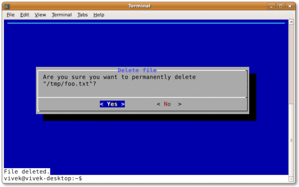
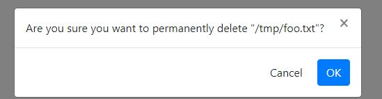

# wdialog
wdialog is the web gui of dialog or xdialog ...

Curse version : 

wdialog version: 

[[!video example](https://i9.ytimg.com/vi_webp/AoQn8MWS_40/mq2.webp?sqp=CJiF2J0G-oaymwEmCMACELQB8quKqQMa8AEB-AH-CYAC0AWKAgwIABABGCQgOyh_MA8=&rs=AOn4CLBxuuk_XnJA4dFHCcVEciHcUyujNA)(https://youtu.be/AoQn8MWS_40)]

